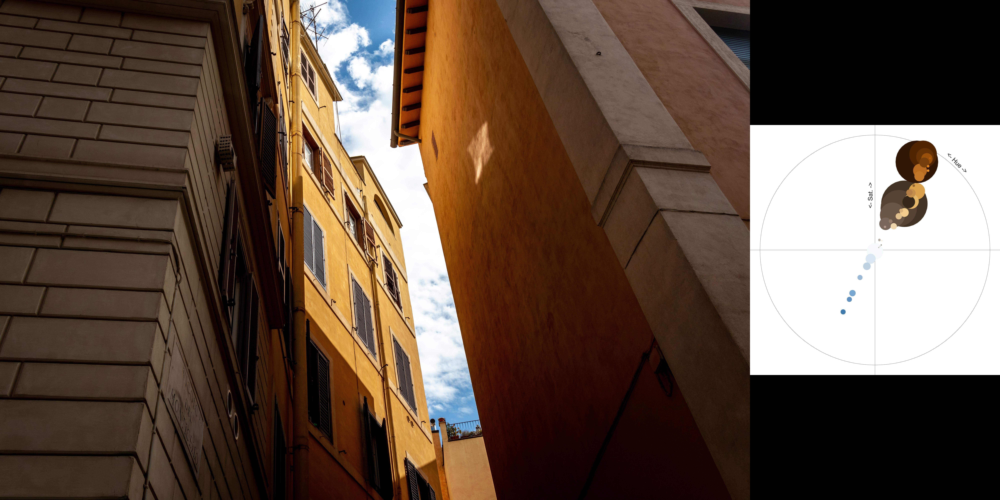

# Photomap

A tool to create collages of a set of pictures and their photomap. Based on http://www.geotests.net/couleurs/index.html.

This is a jupyter notebook.

## Get started

### Install

- `pip install selenium svglib`

- Download [selenium webdriver](https://www.selenium.dev/documentation/webdriver/) in `./`.

### Execute

- Create directory `./svg` and `./collage`.

- Edit input folder `dir` and default download folder `download`.

- Execute each cell.

### Examples

